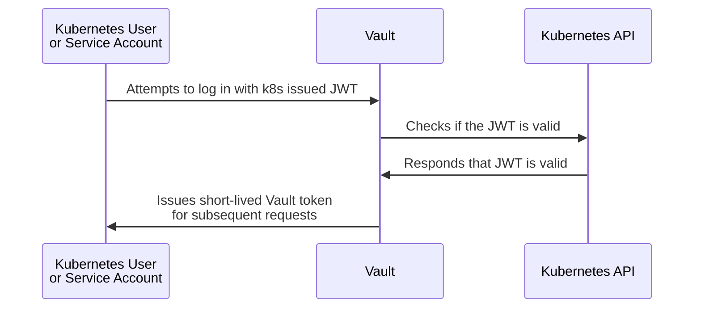

# Vault 101

## Installation

**Vault is not installed through an operator and is not configurable through Kubernetes.**
Vault is installed through through the [vault-helm] chart.

## Initialization

Vault is deployed uninitialized.
It must be initialized before it can be configured.

## Unsealing

Vault is encrypted at rest.
When Vault is started, the encrypted data must be decrypted for Vault services to function.
This process is called *unsealing*.

By default, Vault is sealed with a [Shamir] set of 5 keys.
3 of these keys are required to unseal Vault when it's started.

**This is required after Vault is initialized and every time a Vault pod is restarted!**
The pod will show "Running" but will not be "Ready" until Vault is unsealed.

**Vault Docs:** [Seal/Unseal]

## Auto-Unseal

Vault has a capability called *Auto-Unseal* which will automatically unseal Vault when started.
To use this capability, you need to have an external KMS (Key Management Service) or HSM (Hardware Security Module).
The KMS can be another instance of Vault (that instance must be unsealed!), AWS KMS, Azure Key Vault, or GCP Cloud KMS.

(I'm not 100% sure if HSM auto-unseal can be used with Vault running in Pods on Kubernetes.
Open a PR if you know!)

**For production Vault instances, auto-unseal should be configured.**

For lab instances, [vault-init] runs a script when Vault Pods are started that reads Shamir keys from a Kubernetes secret and executes the unseal commands using those keys.

**Vault Docs:** [Auto-Unseal]

## Configuration

Vault is a REST API service.
The primary means of configuration is the [Vault CLI].
Vault does offer a web UI but not everything is configurable through the UI.

Most CLI commands reference specific endpoints to run against.

## Authentication

When Vault is initialized, the only configured authentication is the *Root Token*.
The root token should only be used to configure Vault.
Applications pulling secrets from Vault need to use another authentication method.

### Kubernetes Authentication

Vault provides the *Kubernetes Authentication* method that delegates authentication to Kubernetes.
Kubernetes Users and Service Accounts are assigned a unique [JWT] that is used to authenticate to the Kubernetes API.
To access Vault, Kubernetes Users and Service Accounts use that same JWT for authentication.
Vault then passes the JWT directly to the Kubernetes API for validation.
If the JWT is valid, the user or service account is logged into Vault and given a temporary token for subsequent Vault API requests.

[Auto-Unseal]: https://learn.hashicorp.com/collections/vault/auto-unseal
[Seal/Unseal]: https://www.vaultproject.io/docs/concepts/seal
[Shamir]: https://en.wikipedia.org/wiki/Shamir%27s_Secret_Sharing
[Vault CLI]: https://www.vaultproject.io/docs/commands
[vault-helm]: https://github.com/hashicorp/vault-helm
[vault-init]: https://github.com/hello-openshift-vault/vault-init
[JWT]: https://jwt.io/
